# Design Document: Ethio Gigs (HibreWork)

## Overview

Ethio Gigs is a bilingual (Amharic + English) freelance marketplace platform targeting Ethiopia, connecting verified freelancers with local and global clients. The platform is built on a trust-first model with local payment integrations (Telebirr, CBE Birr, bank transfer), National ID / KYC verification, escrow-based payments, and a smart matching engine.

The existing codebase is a Node.js/Express backend with a MySQL database and Socket.io for real-time messaging. This design extends and formalizes that foundation into a production-grade architecture covering all 16 requirements.

### Key Design Goals

- **Trust-first**: KYC verification, escrow payments, and dispute resolution are first-class citizens
- **Bilingual**: Full Amharic + English support at every layer (UI, notifications, user content)
- **Mobile-first**: Responsive from 320px to desktop
- **Local payment integration**: Telebirr, CBE Birr, Ethiopian bank transfer alongside Visa/MasterCard
- **Scalable**: Designed to grow from Ethiopian market to global reach

---

## Architecture

The system follows a layered monolith architecture with clear module boundaries, suitable for the current scale and straightforward to extract into microservices later.

```mermaid
graph TD
    subgraph Client Layer
        WEB[Web Browser / Mobile Browser]
    end

    subgraph API Layer
        GW[Express API Gateway]
        AUTH[Auth Module]
        USERS[User / Profile Module]
        JOBS[Jobs & Gigs Module]
        PROPOSALS[Proposals Module]
        PAYMENTS[Payment Module]
        ESCROW[Escrow Module]
        CHAT[Messaging Module]
        NOTIF[Notification Module]
        KYC[KYC / Trust Module]
        MATCH[Smart Matching Engine]
        REPUTATION[Reputation Module]
        ADMIN[Admin Module]
        I18N[i18n / Translation Module]
        ACADEMY[Learning Academy Module]
    end

    subgraph Real-time Layer
        SOCKETIO[Socket.io Server]
    end

    subgraph Data Layer
        MYSQL[(MySQL Database)]
        REDIS[(Redis Cache)]
        FILESTORE[File Storage - Local / S3]
    end

    subgraph External Services
        TELEBIRR[Telebirr API]
        CBEBIRR[CBE Birr API]
        BANK[Bank Transfer API]
        VISA_MC[Visa / MasterCard Gateway]
        AI_SVC[AI Service - OpenAI / Claude]
        EMAIL_SVC[Email Service - SMTP / SendGrid]
        PUSH_SVC[Push Notification Service]
    end

    WEB --> GW
    WEB <--> SOCKETIO
    GW --> AUTH
    GW --> USERS
    GW --> JOBS
    GW --> PROPOSALS
    GW --> PAYMENTS
    GW --> ESCROW
    GW --> CHAT
    GW --> NOTIF
    GW --> KYC
    GW --> MATCH
    GW --> REPUTATION
    GW --> ADMIN
    GW --> I18N
    GW --> ACADEMY

    AUTH --> MYSQL
    USERS --> MYSQL
    USERS --> FILESTORE
    JOBS --> MYSQL
    JOBS --> REDIS
    PROPOSALS --> MYSQL
    PAYMENTS --> MYSQL
    PAYMENTS --> TELEBIRR
    PAYMENTS --> CBEBIRR
    PAYMENTS --> BANK
    PAYMENTS --> VISA_MC
    ESCROW --> MYSQL
    CHAT --> MYSQL
    CHAT --> SOCKETIO
    NOTIF --> MYSQL
    NOTIF --> EMAIL_SVC
    NOTIF --> PUSH_SVC
    KYC --> MYSQL
    KYC --> FILESTORE
    MATCH --> MYSQL
    MATCH --> REDIS
    REPUTATION --> MYSQL
    ADMIN --> MYSQL
    I18N --> AI_SVC
    ACADEMY --> MYSQL
```



### Architectural Decisions

- **Layered monolith over microservices**: The team is small and the codebase is early-stage. A well-structured monolith with clear module boundaries is faster to build and easier to debug. Module boundaries are designed so extraction to microservices is straightforward later.
- **MySQL as primary store**: Already in use; relational model fits the domain well (users, jobs, proposals, contracts, payments all have clear relationships).
- **Redis for caching**: Match scores, session tokens, and rate-limiting counters benefit from fast in-memory access.
- **Socket.io for real-time**: Already scaffolded in the codebase; handles chat and live notifications.
- **JWT for authentication**: Stateless tokens with Redis-backed revocation list for logout/ban scenarios.

---

## Components and Interfaces

### Auth Module

Handles registration, login, OAuth, session management, and account lockout.

```
POST /api/auth/register          - Register with email/phone/password
POST /api/auth/login             - Login, returns JWT
POST /api/auth/logout            - Invalidate token
POST /api/auth/verify-otp        - Verify OTP sent to email/phone
POST /api/auth/resend-otp        - Resend OTP
POST /api/auth/forgot-password   - Send password reset link
POST /api/auth/reset-password    - Reset password with token
GET  /api/auth/google            - Initiate Google OAuth
GET  /api/auth/google/callback   - Google OAuth callback
POST /api/auth/switch-role       - Switch between Freelancer and Client role
```

### User / Profile Module

```
GET    /api/users/:id                  - Get public profile
PUT    /api/users/:id/profile          - Update profile fields
POST   /api/users/:id/portfolio        - Add portfolio item
DELETE /api/users/:id/portfolio/:itemId - Remove portfolio item
PUT    /api/users/:id/availability     - Update availability calendar
GET    /api/users/:id/reviews          - Get reviews for a user
POST   /api/users/favorites/:targetId  - Save freelancer to favorites
DELETE /api/users/favorites/:targetId  - Remove from favorites
GET    /api/users/favorites            - List saved freelancers
```

### Jobs & Gigs Module

```
POST   /api/jobs                  - Create job posting
GET    /api/jobs                  - List/search jobs
GET    /api/jobs/:id              - Get job detail
PUT    /api/jobs/:id              - Update job
DELETE /api/jobs/:id              - Delete/cancel job
POST   /api/gigs                  - Create gig with packages
GET    /api/gigs/:id              - Get gig detail
PUT    /api/gigs/:id              - Update gig
POST   /api/ai/generate-job       - AI job description generator
```

### Proposals Module

```
POST /api/proposals               - Submit proposal
GET  /api/proposals/job/:jobId    - List proposals for a job
PUT  /api/proposals/:id/status    - Accept / reject / shortlist
POST /api/proposals/:id/invite    - Invite freelancer to job
```

### Payment & Escrow Module

```
POST /api/payments/initiate       - Initiate payment (fund escrow)
POST /api/payments/webhook        - Payment gateway webhook
GET  /api/payments/history        - Transaction history
POST /api/escrow/release-milestone - Release milestone payment
POST /api/escrow/release-full     - Release full escrow on completion
POST /api/escrow/refund           - Refund escrow (dispute resolution)
POST /api/wallet/withdraw         - Initiate withdrawal
GET  /api/wallet/balance          - Get wallet balance
GET  /api/invoices/:contractId    - Download invoice PDF
```

### Messaging Module

```
GET  /api/chat/conversations/:userId  - List conversations
GET  /api/chat/messages/:conversationId - Get messages
POST /api/chat/messages               - Send message (REST fallback)
POST /api/chat/report/:messageId      - Report message

Socket.io events:
  chat:send    - Send message
  chat:receive - Receive message
  chat:typing  - Typing indicator
  chat:read    - Mark as read
```

### Notification Module

```
GET  /api/notifications/:userId       - Get notifications
POST /api/notifications/read/:id      - Mark single as read
POST /api/notifications/read-all      - Mark all as read
PUT  /api/notifications/preferences   - Update notification preferences

Socket.io events:
  notification:new  - Push new notification to client
```

### KYC / Trust Module

```
POST /api/kyc/submit              - Submit KYC documents
GET  /api/kyc/status/:userId      - Get KYC status
POST /api/kyc/review/:id          - Admin: approve/reject KYC
POST /api/skill-tests/:skillId/start  - Start skill assessment
POST /api/skill-tests/:attemptId/submit - Submit answers
GET  /api/skill-badges/:userId    - Get earned badges
POST /api/disputes                - Raise dispute
GET  /api/disputes/:id            - Get dispute detail
PUT  /api/disputes/:id/resolve    - Admin: resolve dispute
```

### Smart Matching Engine

```
GET  /api/match/job/:jobId        - Get ranked freelancer recommendations
GET  /api/marketplace             - Search/filter marketplace
GET  /api/skills/trending         - Get trending skills
```

### Reputation Module

```
GET  /api/reputation/:freelancerId  - Get reputation data
POST /api/reviews                   - Submit review
```

### Admin Module

```
GET  /api/admin/stats             - Platform analytics
GET  /api/admin/users             - List/search users
PUT  /api/admin/users/:id/suspend - Suspend user
PUT  /api/admin/users/:id/ban     - Ban user
GET  /api/admin/kyc               - Pending KYC queue
PUT  /api/admin/kyc/:id/review    - Approve/reject KYC
GET  /api/admin/disputes          - Dispute queue
PUT  /api/admin/disputes/:id      - Resolve dispute
GET  /api/admin/escrow            - Escrow transactions
POST /api/admin/announcements     - Send announcement
```

### i18n / Translation Module

```
GET  /api/i18n/:lang              - Get UI string bundle for language
POST /api/translate               - Translate user-generated content
```

---

## Data Models

### users

| Column | Type | Notes |
|---|---|---|
| id | INT PK AUTO_INCREMENT | |
| full_name | VARCHAR(255) | |
| email | VARCHAR(255) UNIQUE | |
| phone | VARCHAR(30) UNIQUE | |
| password_hash | VARCHAR(255) | bcrypt |
| role | ENUM('freelancer','client','admin') | |
| active_role | ENUM('freelancer','client') | current active role |
| google_id | VARCHAR(255) NULL | OAuth |
| is_verified | TINYINT(1) DEFAULT 0 | KYC verified |
| kyc_status | ENUM('none','pending','approved','rejected') DEFAULT 'none' | |
| wallet_balance | DECIMAL(15,2) DEFAULT 0.00 | |
| language_pref | ENUM('en','am') DEFAULT 'en' | |
| failed_login_attempts | INT DEFAULT 0 | |
| locked_until | DATETIME NULL | |
| is_suspended | TINYINT(1) DEFAULT 0 | |
| is_banned | TINYINT(1) DEFAULT 0 | |
| created_at | DATETIME DEFAULT NOW() | |
| updated_at | DATETIME | |

### freelancer_profiles

| Column | Type | Notes |
|---|---|---|
| id | INT PK | FK → users.id |
| title | VARCHAR(255) | professional title |
| bio | TEXT | up to 1000 chars |
| bio_am | TEXT | Amharic bio |
| hourly_rate | DECIMAL(10,2) | |
| availability_status | ENUM('available','busy','unavailable') | |
| avg_rating | DECIMAL(3,2) DEFAULT 0.00 | computed |
| total_completed | INT DEFAULT 0 | computed |
| completion_rate | DECIMAL(5,2) DEFAULT 0.00 | computed |
| response_rate | DECIMAL(5,2) DEFAULT 0.00 | computed |
| avg_response_time_hrs | DECIMAL(5,2) | computed |
| reputation_level | ENUM('bronze','silver','gold','platinum','diamond') DEFAULT 'bronze' | |
| reputation_score | DECIMAL(10,2) DEFAULT 0.00 | computed |
| profile_photo_url | VARCHAR(500) NULL | |
| updated_at | DATETIME | |

### skills

| Column | Type | Notes |
|---|---|---|
| id | INT PK AUTO_INCREMENT | |
| name | VARCHAR(100) | |
| name_am | VARCHAR(100) | Amharic name |
| category | VARCHAR(100) | |

### freelancer_skills

| Column | Type | Notes |
|---|---|---|
| freelancer_id | INT FK → users.id | |
| skill_id | INT FK → skills.id | |
| proficiency | ENUM('beginner','intermediate','expert') | |

### portfolio_items

| Column | Type | Notes |
|---|---|---|
| id | INT PK AUTO_INCREMENT | |
| freelancer_id | INT FK → users.id | |
| title | VARCHAR(255) | |
| description | TEXT | |
| item_type | ENUM('image','document','link') | |
| url | VARCHAR(500) | |
| created_at | DATETIME | |

### availability_calendar

| Column | Type | Notes |
|---|---|---|
| id | INT PK AUTO_INCREMENT | |
| freelancer_id | INT FK → users.id | |
| date | DATE | |
| is_available | TINYINT(1) | |

### jobs

| Column | Type | Notes |
|---|---|---|
| id | INT PK AUTO_INCREMENT | |
| client_id | INT FK → users.id | |
| title | VARCHAR(255) | |
| description | TEXT | |
| budget_min | DECIMAL(10,2) | |
| budget_max | DECIMAL(10,2) | |
| project_type | ENUM('fixed','hourly') | |
| deadline | DATE NULL | |
| status | ENUM('open','in_progress','completed','cancelled') DEFAULT 'open' | |
| escrow_amount | DECIMAL(15,2) DEFAULT 0.00 | |
| payment_status | ENUM('unfunded','funded','released','refunded') DEFAULT 'unfunded' | |
| no_proposal_notified | TINYINT(1) DEFAULT 0 | 7-day nudge sent |
| created_at | DATETIME | |

### job_skills

| Column | Type | Notes |
|---|---|---|
| job_id | INT FK → jobs.id | |
| skill_id | INT FK → skills.id | |

### gigs

| Column | Type | Notes |
|---|---|---|
| id | INT PK AUTO_INCREMENT | |
| freelancer_id | INT FK → users.id | |
| title | VARCHAR(255) | |
| description | TEXT | |
| status | ENUM('active','paused','deleted') DEFAULT 'active' | |
| created_at | DATETIME | |

### gig_packages

| Column | Type | Notes |
|---|---|---|
| id | INT PK AUTO_INCREMENT | |
| gig_id | INT FK → gigs.id | |
| package_type | ENUM('basic','standard','premium') | |
| title | VARCHAR(255) | |
| description | TEXT | |
| price | DECIMAL(10,2) | |
| delivery_days | INT | |
| deliverables | JSON | list of deliverable strings |

### proposals

| Column | Type | Notes |
|---|---|---|
| id | INT PK AUTO_INCREMENT | |
| job_id | INT FK → jobs.id | |
| freelancer_id | INT FK → users.id | |
| cover_letter | TEXT | |
| bid_amount | DECIMAL(10,2) | |
| delivery_days | INT | |
| status | ENUM('pending','shortlisted','accepted','rejected') DEFAULT 'pending' | |
| created_at | DATETIME | |

### contracts

| Column | Type | Notes |
|---|---|---|
| id | INT PK AUTO_INCREMENT | |
| job_id | INT FK → jobs.id NULL | |
| gig_id | INT FK → gigs.id NULL | |
| client_id | INT FK → users.id | |
| freelancer_id | INT FK → users.id | |
| total_amount | DECIMAL(15,2) | |
| platform_fee | DECIMAL(15,2) | |
| status | ENUM('active','completed','cancelled','disputed') DEFAULT 'active' | |
| created_at | DATETIME | |
| completed_at | DATETIME NULL | |

### milestones

| Column | Type | Notes |
|---|---|---|
| id | INT PK AUTO_INCREMENT | |
| contract_id | INT FK → contracts.id | |
| title | VARCHAR(255) | |
| amount | DECIMAL(15,2) | |
| due_date | DATE NULL | |
| status | ENUM('pending','submitted','approved','released') DEFAULT 'pending' | |
| released_at | DATETIME NULL | |

### transactions

| Column | Type | Notes |
|---|---|---|
| id | INT PK AUTO_INCREMENT | |
| contract_id | INT FK → contracts.id NULL | |
| user_id | INT FK → users.id | |
| type | ENUM('escrow_fund','milestone_release','full_release','withdrawal','refund','fee') | |
| amount | DECIMAL(15,2) | |
| method | ENUM('telebirr','cbe_birr','bank_transfer','visa','mastercard','wallet') | |
| status | ENUM('pending','completed','failed') | |
| gateway_ref | VARCHAR(255) NULL | external reference |
| created_at | DATETIME | |

### messages

| Column | Type | Notes |
|---|---|---|
| id | INT PK AUTO_INCREMENT | |
| conversation_id | INT FK → conversations.id | |
| sender_id | INT FK → users.id | |
| content | TEXT | |
| content_type | ENUM('text','image','document','voice') DEFAULT 'text' | |
| file_url | VARCHAR(500) NULL | |
| is_read | TINYINT(1) DEFAULT 0 | |
| is_reported | TINYINT(1) DEFAULT 0 | |
| created_at | DATETIME | |

### conversations

| Column | Type | Notes |
|---|---|---|
| id | INT PK AUTO_INCREMENT | |
| contract_id | INT FK → contracts.id NULL | |
| participant_a | INT FK → users.id | |
| participant_b | INT FK → users.id | |
| created_at | DATETIME | |

### notifications

| Column | Type | Notes |
|---|---|---|
| id | INT PK AUTO_INCREMENT | |
| user_id | INT FK → users.id | |
| event_type | VARCHAR(100) | e.g. 'proposal_received' |
| title | VARCHAR(255) | |
| title_am | VARCHAR(255) | Amharic title |
| message | TEXT | |
| message_am | TEXT | Amharic message |
| is_read | TINYINT(1) DEFAULT 0 | |
| created_at | DATETIME | |

### notification_preferences

| Column | Type | Notes |
|---|---|---|
| user_id | INT FK → users.id | |
| event_type | VARCHAR(100) | |
| in_app_enabled | TINYINT(1) DEFAULT 1 | |
| email_enabled | TINYINT(1) DEFAULT 1 | |

### kyc_submissions

| Column | Type | Notes |
|---|---|---|
| id | INT PK AUTO_INCREMENT | |
| user_id | INT FK → users.id | |
| id_document_url | VARCHAR(500) | |
| selfie_url | VARCHAR(500) | |
| status | ENUM('pending','approved','rejected') DEFAULT 'pending' | |
| rejection_reason | TEXT NULL | |
| reviewed_by | INT FK → users.id NULL | admin |
| submitted_at | DATETIME | |
| reviewed_at | DATETIME NULL | |

### skill_badges

| Column | Type | Notes |
|---|---|---|
| id | INT PK AUTO_INCREMENT | |
| skill_id | INT FK → skills.id | |
| user_id | INT FK → users.id | |
| awarded_at | DATETIME | |

### disputes

| Column | Type | Notes |
|---|---|---|
| id | INT PK AUTO_INCREMENT | |
| contract_id | INT FK → contracts.id | |
| raised_by | INT FK → users.id | |
| reason | TEXT | |
| status | ENUM('open','under_review','resolved') DEFAULT 'open' | |
| resolution | TEXT NULL | |
| resolved_by | INT FK → users.id NULL | admin |
| created_at | DATETIME | |
| resolved_at | DATETIME NULL | |

### reviews

| Column | Type | Notes |
|---|---|---|
| id | INT PK AUTO_INCREMENT | |
| contract_id | INT FK → contracts.id | |
| reviewer_id | INT FK → users.id | |
| reviewee_id | INT FK → users.id | |
| rating | TINYINT | 1–5 |
| comment | TEXT | |
| created_at | DATETIME | |

### certifications

| Column | Type | Notes |
|---|---|---|
| id | INT PK AUTO_INCREMENT | |
| title | VARCHAR(255) | |
| skill_id | INT FK → skills.id | |
| price | DECIMAL(10,2) | 0 = free |
| description | TEXT | |

### user_certifications

| Column | Type | Notes |
|---|---|---|
| id | INT PK AUTO_INCREMENT | |
| user_id | INT FK → users.id | |
| certification_id | INT FK → certifications.id | |
| completed_at | DATETIME | |

---

## Correctness Properties

*A property is a characteristic or behavior that should hold true across all valid executions of a system — essentially, a formal statement about what the system should do. Properties serve as the bridge between human-readable specifications and machine-verifiable correctness guarantees.*


### Property Reflection

Before writing properties, reviewing for redundancy:

- **4.3 and 8.2** both test "matching engine returns ≤ 10 results" — consolidate into one property.
- **7.8 and 7.9** both test "escrow is frozen when dispute is raised" — consolidate into one property.
- **8.1 and 8.2 ranking** — 8.2's ranking aspect is subsumed by 8.1's monotonicity property.
- **6.3 and 6.4** (milestone release and full release) share the same invariant: wallet delta = released amount, escrow delta = -released amount. Consolidate into one escrow release property.
- **9.1 and 9.2** both test reputation level assignment correctness — consolidate into one property about score-to-level mapping determinism.

After reflection, the final property set is:

---

### Property 1: No Duplicate Accounts

*For any* email address or phone number that is already registered in the system, a second registration attempt using that same email or phone SHALL be rejected with an error, and the total number of user accounts SHALL remain unchanged.

**Validates: Requirements 1.3**

---

### Property 2: Login Returns Token for Valid Credentials

*For any* registered user account with a known password, submitting the correct email and password to the login endpoint SHALL return a valid JWT session token.

**Validates: Requirements 1.5**

---

### Property 3: Password Reset Token Expiry

*For any* generated password reset token, using it before its 30-minute expiry SHALL succeed, and using it after the 30-minute expiry SHALL be rejected.

**Validates: Requirements 1.7**

---

### Property 4: Bio Length Constraint

*For any* string submitted as a Freelancer bio, the platform SHALL accept it if and only if its character length is less than or equal to 1000.

**Validates: Requirements 2.1**

---

### Property 5: Skill Count Limit

*For any* Freelancer, adding skills one at a time SHALL succeed for each addition up to and including the 20th skill, and SHALL be rejected for any addition beyond 20 skills.

**Validates: Requirements 2.2**

---

### Property 6: Portfolio Item Count Limit

*For any* Freelancer, adding portfolio items one at a time SHALL succeed for each addition up to and including the 30th item, and SHALL be rejected for any addition beyond 30 items.

**Validates: Requirements 2.3**

---

### Property 7: Review Rating Range

*For any* integer value submitted as a star rating, the platform SHALL accept it if and only if it falls within the inclusive range [1, 5].

**Validates: Requirements 3.6**

---

### Property 8: Matching Engine Result Count

*For any* job posting submitted to the Smart Matching Engine, the number of returned Freelancer recommendations SHALL be greater than or equal to zero and less than or equal to 10.

**Validates: Requirements 4.3, 8.2**

---

### Property 9: File Attachment Size Limit

*For any* file submitted as a message attachment, the platform SHALL accept it if and only if its size in bytes is less than or equal to 26,214,400 (25 MB).

**Validates: Requirements 5.3**

---

### Property 10: Escrow Funding Invariant

*For any* contract initiation with an agreed payment amount A, after the escrow funding step completes successfully, the escrow record for that contract SHALL hold exactly amount A, and the client's wallet balance SHALL have decreased by exactly A plus the platform fee.

**Validates: Requirements 6.2**

---

### Property 11: Escrow Release Correctness

*For any* approved milestone or completed contract with a release amount R, after the release is processed: the Freelancer's wallet balance SHALL increase by exactly R, and the contract's escrow balance SHALL decrease by exactly R.

**Validates: Requirements 6.3, 6.4**

---

### Property 12: Milestone Count Limit

*For any* contract, adding milestones one at a time SHALL succeed for each addition up to and including the 10th milestone, and SHALL be rejected for any addition beyond 10 milestones.

**Validates: Requirements 6.5**

---

### Property 13: Fee Calculation Consistency

*For any* payment amount A, the platform fee F and net amount N computed by the fee calculation function SHALL satisfy: F + N == A, and F SHALL be non-negative.

**Validates: Requirements 6.10**

---

### Property 14: Escrow Frozen on Dispute

*For any* active contract with funded escrow, raising a Dispute on that contract SHALL result in the escrow status being set to frozen, and no release or withdrawal of those funds SHALL be permitted while the dispute status is 'open' or 'under_review'.

**Validates: Requirements 7.8, 7.9**

---

### Property 15: Matching Engine Ranking Monotonicity

*For any* two Freelancers A and B returned by the Smart Matching Engine for the same job, if A appears before B in the ranked list, then A's composite match score (derived from skill match, rating, price alignment, and response time) SHALL be greater than or equal to B's composite match score.

**Validates: Requirements 8.1**

---

### Property 16: Reputation Level Determinism

*For any* reputation score S, the level assigned by the Reputation System SHALL be the unique level whose defined score threshold range contains S, and this mapping SHALL be consistent — the same score SHALL always produce the same level.

**Validates: Requirements 9.1, 9.2**

---

### Property 17: Notification Preference Enforcement

*For any* user who has disabled a specific notification channel (email or in-app) for a specific event type, triggering that event type SHALL NOT result in a notification being enqueued for that channel for that user.

**Validates: Requirements 10.3**

---

### Property 18: Language Preference Persistence

*For any* language selection (Amharic or English) made by a user, after the session ends and a new session begins, the user's stored language preference SHALL equal the last selected language.

**Validates: Requirements 14.2**

---

### Property 19: Marketplace Price Filter Correctness

*For any* marketplace search with a price range filter [min, max], every Freelancer returned in the results SHALL have an hourly rate R such that min ≤ R ≤ max.

**Validates: Requirements 15.3**

---

## Error Handling

### Authentication Errors

| Scenario | HTTP Status | Response |
|---|---|---|
| Duplicate email/phone on registration | 409 Conflict | `{ error: "EMAIL_ALREADY_REGISTERED" }` |
| Invalid credentials on login | 401 Unauthorized | `{ error: "INVALID_CREDENTIALS" }` |
| Account locked | 423 Locked | `{ error: "ACCOUNT_LOCKED", unlockAt: "<ISO timestamp>" }` |
| Expired/invalid JWT | 401 Unauthorized | `{ error: "TOKEN_EXPIRED" }` |
| Expired reset token | 400 Bad Request | `{ error: "RESET_TOKEN_EXPIRED" }` |

### Validation Errors

All validation errors return `422 Unprocessable Entity` with a structured body:

```json
{
  "error": "VALIDATION_ERROR",
  "fields": {
    "bio": "Bio must not exceed 1000 characters",
    "rating": "Rating must be between 1 and 5"
  }
}
```

### Payment Errors

| Scenario | HTTP Status | Response |
|---|---|---|
| Payment gateway failure | 502 Bad Gateway | `{ error: "PAYMENT_GATEWAY_ERROR", detail: "<gateway message>" }` |
| Insufficient wallet balance | 400 Bad Request | `{ error: "INSUFFICIENT_BALANCE" }` |
| Escrow already funded | 409 Conflict | `{ error: "ESCROW_ALREADY_FUNDED" }` |
| Release blocked by dispute | 403 Forbidden | `{ error: "ESCROW_FROZEN_DISPUTE" }` |

### File Upload Errors

| Scenario | HTTP Status | Response |
|---|---|---|
| File exceeds 25 MB | 413 Payload Too Large | `{ error: "FILE_TOO_LARGE", maxBytes: 26214400 }` |
| Unsupported file type | 415 Unsupported Media Type | `{ error: "UNSUPPORTED_FILE_TYPE" }` |

### General Error Strategy

- All errors include a machine-readable `error` code and a human-readable `message` field
- Errors are translated into the user's language preference where applicable
- 5xx errors are logged with full stack traces; clients receive a sanitized message
- Payment failures never silently discard funds — escrow state is preserved on any error

---

## Testing Strategy

### Dual Testing Approach

The testing strategy combines unit/example-based tests for specific behaviors with property-based tests for universal invariants.

### Property-Based Testing

Property-based testing is applicable to this feature because the core business logic (escrow math, reputation scoring, matching ranking, input validation constraints) involves pure functions with clear input/output behavior and universal properties that hold across a wide input space.

**Library**: [fast-check](https://github.com/dubzzz/fast-check) (JavaScript/Node.js)

**Configuration**: Each property test runs a minimum of 100 iterations.

**Tag format**: `// Feature: ethio-gigs, Property N: <property_text>`

Each correctness property maps to a single property-based test:

| Property | Test Description | fast-check Arbitraries |
|---|---|---|
| P1: No Duplicate Accounts | Register same email twice, verify rejection | `fc.emailAddress()` |
| P2: Login Returns Token | Valid credentials always return JWT | `fc.record({ email, password })` |
| P3: Reset Token Expiry | Token valid before 30min, invalid after | `fc.date()` with time offset |
| P4: Bio Length Constraint | Accept ≤1000 chars, reject >1000 | `fc.string({ maxLength: 2000 })` |
| P5: Skill Count Limit | 20th skill accepted, 21st rejected | `fc.array(skillId, { maxLength: 25 })` |
| P6: Portfolio Count Limit | 30th item accepted, 31st rejected | `fc.array(portfolioItem, { maxLength: 35 })` |
| P7: Review Rating Range | Accept [1,5], reject outside | `fc.integer({ min: -10, max: 20 })` |
| P8: Match Result Count | Result count ≤ 10 | `fc.record({ job, freelancers })` |
| P9: File Size Limit | Accept ≤25MB, reject >25MB | `fc.integer({ min: 0, max: 50_000_000 })` |
| P10: Escrow Funding Invariant | Escrow = agreed amount | `fc.float({ min: 1, max: 100_000 })` |
| P11: Escrow Release Correctness | Wallet delta = release amount | `fc.float({ min: 1, max: 100_000 })` |
| P12: Milestone Count Limit | 10th milestone accepted, 11th rejected | `fc.array(milestone, { maxLength: 15 })` |
| P13: Fee Calculation Consistency | fee + net == gross, fee >= 0 | `fc.float({ min: 0.01, max: 1_000_000 })` |
| P14: Escrow Frozen on Dispute | Escrow frozen after dispute raised | `fc.record({ contractId, raisedBy })` |
| P15: Ranking Monotonicity | Results sorted by descending score | `fc.array(freelancerWithScore)` |
| P16: Reputation Level Determinism | Same score → same level always | `fc.float({ min: 0, max: 1000 })` |
| P17: Notification Preference Enforcement | Disabled channel not enqueued | `fc.record({ userId, eventType, channel })` |
| P18: Language Preference Persistence | Language survives session reset | `fc.constantFrom('en', 'am')` |
| P19: Price Filter Correctness | All results within price range | `fc.record({ min, max, freelancers })` |

### Unit / Example-Based Tests

Unit tests cover:
- Account lockout after 5 failed login attempts (Requirement 1.6)
- 7-day no-proposal job notification trigger (Requirement 4.9)
- KYC submission triggers admin queue notification (Requirement 7.2)
- Skill badge awarded after passing assessment (Requirement 7.6)
- Reputation level-up notification sent (Requirement 9.5)
- Unread notification count badge cleared on mark-all-read (Requirement 10.5)
- Invoice PDF generated for completed contract (Requirement 6.7)
- Admin can suspend/ban user (Requirement 7.10)

### Integration Tests

Integration tests (1–3 examples each) cover:
- OTP delivery within 60 seconds of registration (Requirement 1.2)
- Payment gateway webhook processing for Telebirr, CBE Birr, Visa (Requirement 6.1)
- Wallet withdrawal processed within 3 business days (Requirement 6.6)
- Email notification delivered within 5 minutes of event (Requirement 10.2)
- Admin alert delivered within 2 minutes for KYC/dispute events (Requirement 10.6)
- Search results returned within 3 seconds (Requirement 15.4)
- Matching engine responds within 5 seconds (Requirement 4.3 SLA)

### Smoke Tests

- Platform starts and connects to MySQL successfully
- Socket.io server accepts connections
- File storage (local/S3) is writable
- Payment gateway credentials are valid
- Email service is reachable
